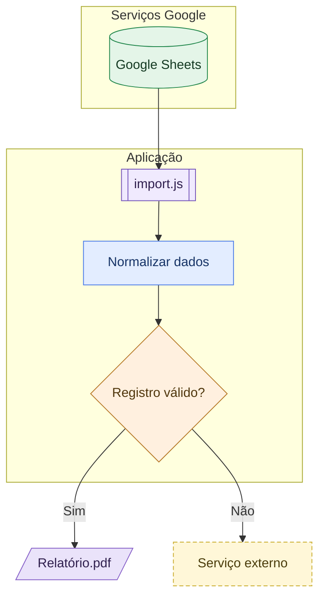

# Convenção visual Mermaid (obrigatória em diagramas novos)

- Preferir `flowchart TB` (vertical). Usar LR apenas se o vertical reduzir a legibilidade; jamais forçar um diagrama ilegível.
- Formas: dados/planilhas `[(...)]`; tarefa `[ ... ]`; decisão `{ ... }` com arestas nomeadas; código `[[ ... ]]` (subprocesso com bordas laterais); documentos `[/ ... /]`; serviço externo retângulo tracejado (`classDef external ...stroke-dasharray: 5 3`).
- Cores semânticas fixas independentemente das cores do tema: Google Sheets verde `#E4F5E8/#20864B`; documentos estáticos roxo `#EAE3FA/#8760C8`; tarefas azul `#E3EDFF/#4A7BE8`; serviços/ferramentas amarelo `#FFF7D8/#C9AC2D`. Banco não-Sheets: azul suave ou cor contextual distinta; checar contraste. Código: violeta suave, diferenciar de documento pela forma. Decisão: neutra ou laranja, não confundir com serviços.
- Agrupar com `subgraph` quando houver fronteira lógica clara (Firebase, Serviços Google, Apps Script). A posição dos nós em subgraphs depende do renderizador; inspecionar resultado. Preferir nomes curtos; usar novo diagrama se ultrapassar a leitura confortável.
- Sem emojis como símbolos principais; símbolos nativos Mermaid são mais portáveis. As imagens fornecidas pelo usuário são referências visuais, não fontes de fatos do repositório.

