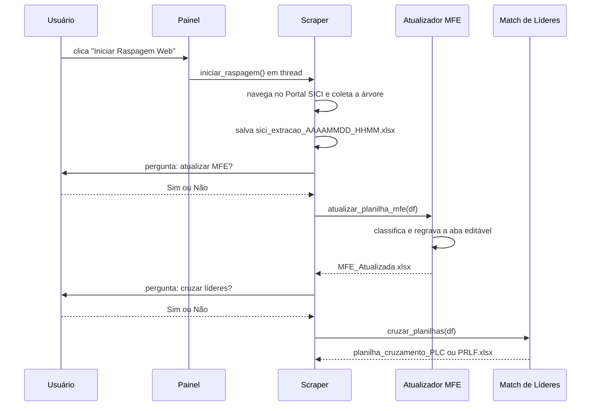

# Arquitetura

## Visão geral e objetivo

O sistema automatiza a extração da árvore de cargos da Prefeitura do Rio (Portal SICI) e a atualização do Mapeamento de Funções Estratégicas (MFE), além de cruzamentos de lideranças (Líderes Cariocas e Liderança Feminina). É uma aplicação de desktop em Python, com interface gráfica (Tkinter), scraping via Selenium/Chrome e processamento de planilhas via pandas/openpyxl.

O ponto de entrada é `painel_principal.py`; o pacote pode ser distribuído como executável `--onedir` via PyInstaller. O diagrama de componentes está na página [Início](index.md).

## Organização dos módulos

| Módulo | Responsabilidade | Entrada | Saída |
|---|---|---|---|
| `painel_principal.py` | GUI e orquestração; inicia raspagem em thread e oferece rotinas offline | cliques do usuário | estado da interface |
| `scraper_sici_nome.py` | navega o Portal SICI, coleta a árvore e encadeia os próximos passos | Portal SICI | `sici_extracao_*.xlsx`, `sici_parcial.xlsx` |
| `atualizador_MFE.py` | aplica regras de classificação e regrava a aba editável do MFE | DataFrame/path SICI + config + bases opcionais | `MFE_Atualizada.xlsx` |
| `area_negocio_ml.py` | carrega modelos e prediz área de negócio | lista de áreas | lista de áreas de negócio |
| `calculadora_tercis.py` | calcula magnitude (tercis) a partir de empenhos | arquivo de empenhos | DataFrame agrupado |
| `match_lideres.py` | cruza lideranças (LC/PRLF) com o SICI | SICI + base de nomes | `planilha_cruzamento_PLC/PRLF.xlsx` |
| `gestores_equipes.py` | painel independente CGGI (gestores/ordenadores) | SICI + base CGGI | `resultado_cruzamento_{tarefa}.xlsx` |
| `config_manager.py` | cria e lê `config.txt` | `config.txt` | dicionários/listas |

### Relação entre scraping, regras, planilhas e executável

1. O **painel** (ou o executável) chama o **scraper**, que produz o DataFrame/planilha de extração.
2. O **atualizador MFE** consome essa extração, lê as **regras** de `config.txt`, usa o **ML** e os **tercis** e grava na **planilha** `MFE_Atualizada.xlsx`.
3. Os **cruzamentos** de lideranças são opcionais e reutilizam a mesma extração.

Não há banco de dados nem servidor: todo o estado transita por arquivos Excel/CSV locais.

## Fluxo de execução



A sequência acima mostra o caminho em que o usuário aceita as duas etapas opcionais; se responder "Não", a etapa correspondente é pulada. Os **acionamentos** são manuais; o processamento interno (navegação, classificação, escrita) é automático. Não há agendamento nem automação recorrente.

### A partir do `.exe` (ou de `python painel_principal.py`)

1. O módulo garante a existência de `config.txt` ao lado do executável (`painel_principal.py:12`).
2. A janela Tkinter é montada com 5 botões (`painel_principal.py:96-126`).
3. Cada botão dispara uma rotina:
   - **Raspagem web** → `executar_raspagem_completa()` inicia `iniciar_raspagem()` em uma thread (`painel_principal.py:14-26`).
   - **Somente Atualizar MFE** → seleciona um Excel SICI já extraído e chama `atualizar_planilha_mfe()` (`painel_principal.py:28-38`).
   - **Líderes Cariocas** → `cruzar_planilhas(arquivo, "PLC")` (`painel_principal.py:40-56`).
   - **Liderança Feminina** → `cruzar_planilhas(arquivo, "PRLF")` (`painel_principal.py:58-74`).
   - **Editar configurações** → abre `config.txt` no editor do sistema (`painel_principal.py:78-84`).

## Dependências externas

| Dependência | Uso | Observação |
|---|---|---|
| `selenium` + ChromeDriver | scraping do Portal SICI | requer Chrome instalado e driver compatível |
| `pandas`, `numpy` | manipulação e cruzamento de dados | |
| `openpyxl` | leitura/escrita preservando formatação | |
| `scikit-learn` (`joblib`) | carregamento e predição dos modelos `.pkl` | |
| `tkinter` | interface gráfica e diálogos | biblioteca padrão |
| `requests` | listada em `requirements.txt` | não há uso direto identificado nos módulos principais |

## Execução e configuração

- **Interpretado:** `python painel_principal.py` (ou os módulos individuais, cada um com `if __name__ == "__main__"`).
- **Compilado:** executável gerado por PyInstaller (ver abaixo).
- **Configuração:** `config.txt` é criado automaticamente com padrões se ausente (`config_manager.py:187-191`) e deve permanecer editável ao lado do executável.

## Construção e distribuição do executável

O comando de empacotamento está em `gerar exe.txt` (e reproduzido no README):

```powershell
pyinstaller --clean --onedir --windowed --noconfirm --collect-all selenium --collect-all sklearn --hidden-import joblib --add-data "model_fjg.pkl;." --add-data "vectorizer_fjg.pkl;." --add-data "MFE_Base.xlsx;." --add-data "config.txt;." --icon=icon.ico painel_principal.py
```

- **`--onedir`:** gera uma pasta com o `.exe` e as dependências; o `config.txt` fica editável fora do binário.
- **Recursos embutidos (`--add-data`):** `model_fjg.pkl`, `vectorizer_fjg.pkl`, `MFE_Base.xlsx`, `config.txt`.
- **Resolução de caminhos:** os módulos distinguem execução congelada (`sys.frozen`) e interpretada, buscando recursos em `sys._MEIPASS` (embutido) ou ao lado do executável (`sys.executable`) — ver `area_negocio_ml.py:22-51`, `atualizador_MFE.py:66-103`, `config_manager.py:6-11`.

> **Externo não verificado.** O repositório contém o comando de empacotamento, mas não um arquivo `.spec` versionado (`.spec` está no `.gitignore`). Não é possível confirmar que um executável distribuído corresponda exatamente a este código.

## Testes e automações disponíveis

- **Testes:** não foram encontrados arquivos de teste (`test_*`, `*_test`, `tests/`, `pytest`/`unittest`) no repositório versionado.
- **CI/CD:** não há configuração de integração contínua (`.github/`, `.gitlab-ci.yml`, Jenkinsfile etc.).
- **Agendamento:** não há cron/agendador; toda execução é iniciada manualmente.
- **Lint/tipagem:** nenhuma configuração identificada.

> Essa ausência é uma constatação, não uma presunção. A ausência de testes é tratada em [Avaliação técnica](technical-review.md).
