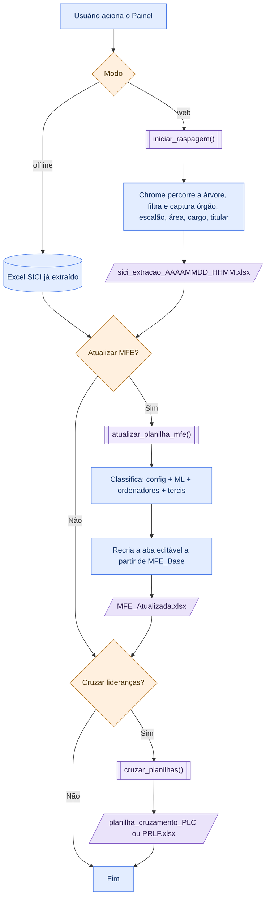

# Fluxo e rastreabilidade dos dados

Este documento descreve como as informações chegam ao sistema, são processadas e chegam às planilhas finais. O objetivo é permitir que um desenvolvedor compreenda o fluxo completo e a origem de cada campo.

> **Como ler este documento.** Distinguimos quatro graus de certeza:
>
> - **Confirmado pelo código** — comportamento observado nos módulos Python do repositório.
> - **Artefato existente** — informação presente no grafo Graphify ou nos diagramas Diagram Design, ainda não reconfirmada no código.
> - **Externo não verificado** — contrato esperado a partir de bases/portais externos que não foram acessados durante a auditoria.
> - **Inferência/pendente** — dedução razoável que depende de confirmação.

---

## 1. Fluxo completo



---

## 2. Mapeamento estratégico e regras de negócio

Toda a classificação ocorre em `atualizar_planilha_mfe()` (`atualizador_MFE.py:62-350`), com apoio de `area_negocio_ml.py`, `calculadora_tercis.py` e `config_manager.py`.

### Chave de correspondência

Cada registro do SICI é indexado pela chave composta normalizada:

```
org|escalão|área|cargo|titular_normalizado
```

`normalizar()` remove acentos, minúsculas e caracteres não alfanuméricos; `normalizar_nome()` preserva espaços (`atualizador_MFE.py:29-43`). Como a chave é usada como chave de dicionário (`sici_keys`), registros duplicados são colapsados (o último sobrescreve o anterior).

### Regras de classificação por campo

| Campo calculado | Regra | Decisão |
|---|---|---|
| Tipo de Cargo (F) | `dic_tipos.get(cargo_normalizado, "")` — correspondência exata | automática |
| Macro Área (H) | `dic_macroareas.get(org_normalizado, "")` — correspondência exata | automática |
| Área de Negócio (G) | predição do modelo ML a partir de `área` | automática, com alerta de revisão |
| Gere equipe (I) | `"1 - Não"` se tipo de cargo for `Ouvidor(a)`, senão `"2 - Sim"` | automática |
| Autonomia para ordenar despesa (J) | `"2 - Sim"` se titular é ordenador, senão `"1 - Não"` | automática (condicionada a acionamento) |
| Poder de Decisão (L) | `"2 - Possui…"` se é ordenador **ou** cargo em `CARGO_EXATO` **ou** área contém texto de `AREA_CONTEM`; senão `"1 - Não possui…"` | automática |
| Magnitude do Orçamento (K) | classificação em tercis a partir dos empenhos | automática (condicionada a acionamento) |

### Lógica de negócio do ML (Área de Negócio)

- `prever_area_negocio()` (`area_negocio_ml.py:85-114`) carrega `model_fjg.pkl` e `vectorizer_fjg.pkl`, limpa a área (minúsculas, remove pontuação e stopwords) e prediz a área de negócio.
- Se a confiança máxima for **inferior a 75%**, o valor retornado é prefixado com `⚠️ REVISÃO MANUAL (XX% de Confiança): …` (`area_negocio_ml.py:101-108`). Esse prefixo dispara destaque amarelo na célula G ao escrever (`atualizador_MFE.py:324-326`).
- Se os modelos não forem encontrados, a área de negócio fica vazia (`area_negocio_ml.py:64-66,90-91`).

> **Inferência/pendente.** O alerta "REVISÃO MANUAL" solicita revisão, mas o código não registra se a revisão foi feita nem altera o valor posteriormente. A confirmação humana é uma etapa externa ao sistema.

### Lógica de negócio dos tercis (Magnitude do Orçamento)

`gerar_dataframe_empenhos()` (`calculadora_tercis.py:57-116`):

1. Lê o arquivo de empenhos (Excel ou CSV `;` latin1).
2. Extrai o nome do campo `Unidade Gestora / Assinatura Empenho`, removendo CPF/CNPJ no início (`extrair_nome_sem_cpf`).
3. Normaliza o nome e soma `Valor Empenhado` por assinatura (após limpeza do formato brasileiro).
4. Calcula os limites nos quantis 33,33% e 66,66% e classifica em faixas (2º/3º/4º tercil).
5. Gera o texto `"N - Ordena na faixa do Xº Tercil (…)| Q empenho(s)"` ou `"1 - Não ordena despesa | 0 empenho(s)"`.

O titular do SICI é associado ao tercil pela chave de nome normalizado (`atualizador_MFE.py:214-216,260-265`).

### Lógica de negócio dos ordenadores

- O titular é considerado ordenador se o nome normalizado (com mais de 2 caracteres e não presente na lista `lixos` = `vago`, `vaga`, `nao informado`, `sem titular`, `-`) constar na base de ordenadores (`atualizador_MFE.py:212,234-236`).
- **Ponto crítico:** quando o usuário opta por **não** verificar ordenadores, a coluna J recebe `"1 - Não"` para todos — indistinguível de um titular que não é ordenador (`atualizador_MFE.py:234-252`).

### Casos sem correspondência, ambíguos ou conflitantes

- **Sem correspondência nos dicionários** (cargo/órgão não mapeados): F e H ficam vazios; nenhum aviso é emitido.
- **Titular vago/ausente:** ordenador = `Não` e tercis = `1 - Não ordena despesa | 0 empenho(s)`.
- **Homônimos:** a correspondência por nome normalizado não distingue pessoas de mesmo nome (ordenadores, lideranças e tercis usam apenas o nome).
- **Registros duplicados do SICI:** colapsados pela chave composta; o último valor prevalece.
- **Cruzamento de lideranças sem tarefa:** o achado P3 da [Avaliação técnica](technical-review.md) registra que uma tarefa sem uso impede a seleção da base correspondente.

### Limitações comprovadas e ação humana

| Condição | Resultado implementado | Limitação ou ação humana necessária | Evidência |
|---|---|---|---|
| Não há de-para de cargo ou órgão | F ou H ficam vazios | Manter `[TIPOS_CARGO]` e `[MACRO_AREAS]` em `config.txt` | `atualizador_MFE.py:254-255` |
| Confiança do ML abaixo de 75% | G recebe marca de revisão manual | Conferir o valor; o sistema não registra a confirmação | `area_negocio_ml.py:101-108` |
| Ordenadores não são verificados | J recebe `1 - Não` para todos | Não interpretar esse valor como confirmação; selecionar a base quando aplicável | `atualizador_MFE.py:234-252` |
| Nomes homônimos | Correspondência por nome normalizado | Conferir manualmente ordenadores, lideranças e tercis | regras descritas nesta seção |
| Chave SICI duplicada | O último registro sobrescreve o anterior | Investigar a duplicidade na fonte quando relevante | `sici_keys` em `atualizador_MFE.py` |
| Coleta interrompida | Arquivo parcial e próximos passos podem ser gerados | Confirmar completude antes de usar a extração | `scraper_sici_nome.py:303-358` |
| Nova execução do MFE | Aba editável é reconstruída | Preservar alterações manuais fora da saída ou atualizá-las na base | `atualizador_MFE.py:306-332` |

---

## 3. Dados automatizados × dados manuais

Abaixo, cada campo identificado pelo nome, com sua origem, o grau de automação e o que acontece quando **surge uma nova secretaria**. Atenção: "automático" não significa que não há trabalho humano — vários campos são automáticos **apenas na execução**, mas dependem de um de-para mantido manualmente.

| # | Campo (destino) | Origem | Modo de atualização | Ao criar nova secretaria |
|---|---|---|---|---|
| 1 | `órgão` (extração) | Portal SICI | Automático (scraping) | **Sim** — capturado do portal |
| 2 | `escalão` (extração) | nível da árvore + tipo do órgão | Automático (derivado) | **Sim** — derivado |
| 3 | `área` (extração) | Portal SICI | Automático (scraping) | **Sim** — capturado do portal |
| 4 | `cargo` (extração) | Portal SICI | Automático (scraping) | **Sim** — capturado do portal |
| 5 | `titular` (extração) | Portal SICI | Automático (scraping) | **Sim** — capturado do portal |
| 6 | `data_extracao` (extração) | relógio no salvamento | Automático (carimbo) | **Sim** |
| 7 | MFE — B `Órgão` | SICI `órgão` | Automático (cópia) | **Sim** — copiado |
| 8 | MFE — C `Escalão` | SICI `escalão` | Automático (cópia) | **Sim** — copiado |
| 9 | MFE — D `Área` | SICI `área` | Automático (cópia) | **Sim** — copiado |
| 10 | MFE — E `Nome do Cargo` | SICI `cargo` | Automático (cópia) | **Sim** — copiado |
| 11 | MFE — F `Tipo de Cargo` | `config.txt` `[TIPOS_CARGO]` | Automático (lookup); vazio sem correspondência | **Não** — vazio se o cargo não tiver de-para |
| 12 | MFE — G `Área de Negócio` | modelo ML sobre `área` | Automático; confiança <75% gera **revisão manual** | **Parcial** — ML prediz, mas pode marcar revisão |
| 13 | MFE — H `Macro Área` | `config.txt` `[MACRO_AREAS]` | Automático (lookup); vazio sem correspondência | **Não** — vazio se o órgão não tiver de-para |
| 14 | MFE — I `Gere equipe` | derivado de `Tipo de Cargo` | Automático (regra binária) | **Sim** — assume `2 - Sim` por padrão |
| 15 | MFE — J `Autonomia para ordenar despesa` | base de Ordenadores + `titular` | **Acionado manualmente** (selecionar base), processamento automático | **Requer ação** — incluir os novos titulares na base |
| 16 | MFE — K `Magnitude do Orçamento` | base de Empenhos + `titular` | **Acionado manualmente** (selecionar base), processamento automático | **Requer ação** — incluir empenhos dos novos titulares |
| 17 | MFE — L `Poder de Decisão` | ordenador / `CARGO_EXATO` / `AREA_CONTEM` | Automático (derivado de J + config) | **Sim**, mas depende de J/`config.txt` |
| 18 | MFE — M `Titular` | SICI `titular` | Automático (cópia) | **Sim** — copiado |
| 19 | MFE — A `ID (automático)` | — | **Não preenchido** pelo código; permanece vazio | **Não** — continua vazio |
| 20 | `config.txt` (todas as seções) | edição humana | **Preenchido manualmente** | **Requer atualização** — novo de-para |
| 21 | `MFE_Base.xlsx` (cabeçalhos, abas, formatação) | manutenção humana | **Preenchido manualmente** | **Não** — estrutura genérica |
| 22 | bases Ordenadores/Empenhos/Minibios/CGGI | fornecidas pelo usuário | **Preenchido manualmente** | **Requer atualização** — novos dados |
| 23 | `status`, `área`, `cargo` (cruzamentos PLC/PRLF/CGGI) | left join por nome | Automático (após seleção manual das bases) | **Requer ação** — selecionar as bases atualizadas |

### Lógica de negócio que sustenta cada automação

- **Cópia direta (B, C, D, E, M):** o valor do SICI é transcrito na coluna correspondente sem transformação de conteúdo.
- **Lookup por dicionário (F, H):** chave normalizada do cargo/órgão → valor do de-para em `config.txt`; ausência de chave resulta em célula vazia.
- **Predição ML (G):** texto da área → modelo `model_fjg.pkl`/`vectorizer_fjg.pkl` → rótulo de área de negócio; confiança <75% marca revisão.
- **Regra binária (I):** `Tipo de Cargo == "Ouvidor(a)"` → `"1 - Não"`, caso contrário `"2 - Sim"`.
- **Ordenador (J):** pertinência do nome normalizado do titular ao conjunto de ordenadores carregado.
- **Poder de Decisão (L):** disjunção de três condições — é ordenador, cargo em `CARGO_EXATO` ou área contém `AREA_CONTEM`.
- **Tercis (K):** soma de empenhos por assinatura normalizada → quantis 33/66 → faixa 2/3/4; sem empenho → `1 - Não ordena despesa`.

### Cenário: criação de uma nova secretaria

Quando um novo órgão entra no Portal SICI, **não basta rodar o programa**. A raspagem e as cópias (B, C, D, E, M) se resolvem sozinhas, mas os campos que dependem de **de-para** (`Tipo de Cargo`, `Macro Área`) **ficam vazios**. Os campos dependentes de **bases externas** (ordenadores, empenhos, lideranças) usam os valores padrão ou deixam de encontrar correspondências até que alguém atualize as bases manualmente.

#### Documentos (arquivos) que precisam ser atualizados

| Arquivo / seção | O que fazer | Coluna afetada | Sem isso... |
|---|---|---|---|
| `config.txt` → `[MACRO_AREAS]` | adicionar `sigla_do_orgao = Macro Área` | H | H fica **vazia** |
| `config.txt` → `[TIPOS_CARGO]` | adicionar de-para para cada **cargo** novo do órgão | F (e indiretamente I) | F fica **vazia** |
| `config.txt` → `[CARGO_EXATO]` / `[AREA_CONTEM]` | se houver cargo/área com poder de decisão específico | L | L pode sair como `1 - Não possui…` |
| Base de Ordenadores (SIAFIC) | incluir os novos titulares ordenadores | J | J sai `1 - Não`, valor que não distingue ausência de verificação de não-ordenador |
| Base de Empenhos (SUPOR) | incluir os empenhos dos novos titulares | K | K sai `1 - Não ordena despesa` |
| Base de lideranças (Minibios / Liderança Feminina) | incluir os novos nomes (se for cruzar) | cruzamentos | líderes não são encontrados |

**Chave do de-para:** a chave de `[MACRO_AREAS]` (e de `[TIPOS_CARGO]`) é o texto **normalizado** do campo raspado. `normalizar()` (`config_manager.py:193-200`) deixa tudo em minúsculas, remove acentos e apaga tudo que não for letra/número. Use a forma normalizada do `órgão`/`cargo` retornado na extração; a apresentação atual do portal não foi verificada nesta auditoria.

#### Partes da documentação que devem ser mantidas coerentes

A documentação **não** enumera cada entrada do de-para — a fonte funcional é o `config.txt`. Ela descreve a regra e a rastreabilidade. Ao criar uma nova secretaria, revise:

| Parte | O que revisar |
|---|---|
| `docs/data-lineage.md` → seção 3 (tabela desta página) | manter a coluna "Ao criar nova secretaria" coerente, se a regra mudar |
| `docs/data-lineage.md` → seção 4.B (`config.txt`) | refletir novas entradas/seções relevantes |
| `docs/data-lineage.md` → seção 6 (rastreabilidade) | manter fonte/regra/responsável atualizados |
| `docs/index.md` e `docs/architecture.md` | **não muda** para um novo órgão (estrutura de módulos é a mesma) |

> Atualizar a documentação é **registro** e não altera o comportamento. O que faz o dado sair preenchido é o `config.txt` e as bases externas.

---

## 4. Fontes de dados

### Entradas manuais e opcionais

| Entrada | Quando é solicitada | Uso |
|---|---|---|
| `config.txt` | sempre (criado com padrões se ausente) | filtros e regras de classificação |
| `MFE_Base.xlsx` | sempre na atualização do MFE | modelo de cabeçalhos, abas e formatação |
| Base de Ordenadores (SIAFIC) | opcional, via diálogo | marcar titulares como ordenadores |
| Base de Empenhos (SUPOR) | opcional, via diálogo | calcular a magnitude (tercis) |
| Minibios / Liderança Feminina | opcional, via diálogo | cruzamento de lideranças |

### A. Portal SICI

- **Origem:** sistema SICI da Prefeitura do Rio (`https://sici.rio.rj.gov.br/PAG/principal.aspx`), consultado por navegador automatizado (Selenium + Chrome).
- **Estrutura:** árvore organizacional em ASP.NET WebForms. O robô percorre nós de nível 1 a 4.
- **Campos extraídos por scraping** (função `capturar_painel()`, `scraper_sici_nome.py:85-89`):

| Campo do DataFrame | Elemento de origem na página |
|---|---|
| `órgão` | texto do nó de nível 1 da árvore |
| `escalão` | derivado do nível da árvore e do tipo de órgão (A/D) |
| `área` | `ContentPlaceHolder1_lblNomeUnidadeGestaoSelecionada` |
| `cargo` | `ContentPlaceHolder1_lblCargo` |
| `titular` | `ContentPlaceHolder1_lblTitular` |
| `data_extracao` | carimbo gerado no momento do salvamento (`scraper_sici_nome.py:322`) |

> **Externo não verificado.** O conteúdo atual do portal não foi acessado durante a auditoria. O contrato acima é o que a implementação espera (IDs de elemento e URL fixos). Qualquer alteração no portal pode quebrar a raspagem.

### B. `config.txt` (manual)

Arquivo de texto editado pelo usuário (`config_manager.py` o cria com padrões na primeira execução). Seções:

| Seção | Conteúdo | Consumidor |
|---|---|---|
| `[PALAVRAS_IGNORADAS]` | termos que fazem um ramo ser ignorado | raspagem |
| `[CARGO_EXATO]` | cargos com poder de decisão garantido | atualizador MFE (coluna L) |
| `[AREA_CONTEM]` | textos que, contidos na área, garantem poder de decisão | atualizador MFE (coluna L) |
| `[TIPOS_CARGO]` | de-para `cargo = tipo de cargo` | atualizador MFE (coluna F) |
| `[MACRO_AREAS]` | de-para `órgão = macro área` | atualizador MFE (coluna H) |

### C. `MFE_Base.xlsx` (manual)

Modelo da planilha de Mapeamento de Funções Estratégicas. Possui 7 abas (`LEIA-ME`, `Todas as Funções (Editável)`, `Notas Médias`, `Cargos Classificados na Reunião`, `Cálculo`, `Menu de Listas Suspensas`, `PREMISSAS`). A aba **`Todas as Funções (Editável)`** tem 13 colunas (A–M) e é a única regravada pelo sistema.

### D. Bases externas (manuais, opcionais)

- **Ordenadores de despesa** (SIAFIC) — o código procura uma coluna chamada `Usuário`; se ausente, usa a 3ª ou a 1ª coluna (`atualizador_MFE.py:164-166`).
- **Empenhos** (SUPOR) — espera as colunas `Unidade Gestora / Assinatura Empenho` e `Valor Empenhado` (`calculadora_tercis.py:69-70`). O README menciona quatro colunas; o código lê duas obrigatórias.
- **Minibios / Liderança Feminina** — deve ter a coluna `NOME` na primeira aba (`match_lideres.py:93`).
- **CGGI** — usada apenas pelo painel independente `gestores_equipes.py`, com a coluna `NOME` (`gestores_equipes.py:71`).

---

## 5. Processo de scraping

- **Acionamento:** botão "1. Iniciar Raspagem Web" do painel, que executa `scraper_sici_nome.iniciar_raspagem()` em uma thread (`painel_principal.py:14-26`). Também pode ser chamado diretamente (`python scraper_sici_nome.py`).
- **Navegação:** `webdriver.Chrome` abre o portal, com `WebDriverWait` e espera por callbacks do ASP.NET (`Sys.WebForms.PageRequestManager`).
- **Coleta:** percorre a árvore; para cada nó, clica/expande e lê os campos do painel. O `escalão` é calculado conforme o nível e o tipo de órgão:

| Nível | Tipo A (Autarquia/Empresa) | Tipo D (Direta) |
|---|---|---|
| 1 | `1º` | `1º` |
| 2 | `1º` | `2º` |
| 3 | `2º` | `3º` |
| 4 | `3º` | (não capturado) |

- **Filtro:** ramos cujo texto contém alguma palavra de `[PALAVRAS_IGNORADAS]` são pulados (`scraper_sici_nome.py:58-60,174`).
- **Tratamentos/validações:** nenhuma validação de conteúdo além do filtro de palavras. Registros com `órgão`/`área`/`cargo`/`titular` vazios ainda são gravados como vierem.
- **Deduplicação:** não há remoção de duplicados na extração; o DataFrame bruto é salvo integralmente.
- **Saída parcial:** a cada 20 iterações é salvo `sici_parcial.xlsx` como contingência (`scraper_sici_nome.py:297-301`).
- **Tratamento de erro:** uma exceção no laço é capturada e o bloco `finally` salva o que foi coletado e oferece os próximos passos. Isso significa que uma coleta interrompida ainda pode gerar arquivo e prosseguir (`scraper_sici_nome.py:303-358`).

---

## 6. Planilhas e destino dos dados

### Entradas

| Arquivo | Aba(s) | Colunas relevantes | Papel |
|---|---|---|---|
| `MFE_Base.xlsx` | `Todas as Funções (Editável)` | A–M (13 colunas) | modelo de cabeçalho/estrutura |
| extração SICI (`sici_extracao_*.xlsx`) | única | `órgão`, `escalão`, `área`, `cargo`, `titular`, `data_extracao` | fonte dos registros |
| base Ordenadores | única | `Usuário` (ou 3ª/1ª coluna) | conjunto de ordenadores |
| base Empenhos | única | `Unidade Gestora / Assinatura Empenho`, `Valor Empenhado` | cálculo de tercis |
| Minibios / Liderança Feminina | primeira | `NOME` (e opcional `CODIGO_LC`) | cruzamento de lideranças |

### Saídas

| Arquivo | Conteúdo | Como é gerado |
|---|---|---|
| `sici_extracao_AAAAMMDD_HHMM.xlsx` | extração bruta do SICI + `data_extracao` | `df.to_excel()` no scraper |
| `sici_parcial.xlsx` | contingência a cada 20 iterações | `df.to_excel()` no scraper |
| `MFE_Atualizada.xlsx` | cópia de `MFE_Base.xlsx` com a aba editável regravada | `shutil.copy` + `openpyxl` |
| `planilha_cruzamento_PLC.xlsx` / `_PRLF.xlsx` | lideranças encontradas em funções estratégicas | `df.to_excel()` em `match_lideres.py` |
| `resultado_cruzamento_{tarefa}.xlsx` | cruzamento CGGI (painel independente) | `df.to_excel()` em `gestores_equipes.py` |
| `Relatorio_Intermediario_Tercis.xlsx` | empenhos agrupados por assinatura | `cruzar_sici_com_tercis()` (helper) |

### Tabela de rastreabilidade (colunas do MFE)

| Campo de destino | Fonte original | Campo de origem | Transformação/regra | Responsável no código | Modo de atualização |
|---|---|---|---|---|---|
| A — ID (automático) | — | — | nenhuma (célula deixada vazia) | `atualizador_MFE.py:285` | Não preenchido |
| B — Órgão | SICI | `órgão` | cópia | `atualizador_MFE.py:286` | Automático |
| C — Escalão | SICI | `escalão` | cópia | `atualizador_MFE.py:287` | Automático |
| D — Área | SICI | `área` | cópia | `atualizador_MFE.py:288` | Automático |
| E — Nome do Cargo | SICI | `cargo` | cópia | `atualizador_MFE.py:289` | Automático |
| F — Tipo de Cargo | `config.txt` | `[TIPOS_CARGO]` | lookup exato normalizado | `atualizador_MFE.py:254,290` | Automático |
| G — Área de Negócio | ML sobre SICI | `área` | predição; <75% → "REVISÃO MANUAL" | `area_negocio_ml.py:85-114`; `atualizador_MFE.py:258,291` | Automático + revisão manual sinalizada |
| H — Macro Área | `config.txt` | `[MACRO_AREAS]` | lookup exato normalizado | `atualizador_MFE.py:255,292` | Automático |
| I — Gere equipe | Tipo de Cargo (F) | `tipo_cargo` | `Ouvidor(a)`→"1-Não", senão "2-Sim" | `atualizador_MFE.py:293-294` | Automático |
| J — Autonomia p/ ordenar despesa | base Ordenadores | `Usuário` | nome normalizado ∈ conjunto | `atualizador_MFE.py:234-238,295` | Acionado manualmente, processamento automático |
| K — Magnitude do Orçamento | base Empenhos | `Valor Empenhado` | tercis por assinatura | `calculadora_tercis.py:57-116`; `atualizador_MFE.py:296` | Acionado manualmente, processamento automático |
| L — Poder de Decisão | ordenador + `config.txt` | `CARGO_EXATO`/`AREA_CONTEM` | disjunção de 3 condições | `atualizador_MFE.py:240-252,297` | Automático |
| M — Titular | SICI | `titular` | cópia | `atualizador_MFE.py:298` | Automático |

### O que é sobrescrito × preservado

- **Sobrescrito:** a aba `Todas as Funções (Editável)` de `MFE_Atualizada.xlsx` é integralmente reconstruída: o arquivo é copiado da base e as linhas de dados são apagadas e reescritas (`atualizador_MFE.py:306-332`). Isso **descarta** qualquer edição feita em uma `MFE_Atualizada.xlsx` anterior.
- **Preservado:** as demais abas (`Cálculo`, `Notas Médias`, `Cargos Classificados na Reunião`, `Menu de Listas Suspensas`, `PREMISSAS`, `LEIA-ME`) e a formatação são herdadas de `MFE_Base.xlsx` e **não são recalculadas** para os novos registros.
- **Cabeçalho:** a célula M1 recebe `"Titular"` caso esteja vazia (`atualizador_MFE.py:311-313`); os demais cabeçalhos não são alterados.
- **Destaques:** células G com prefixo `⚠️` e células I com `"1 - Não"` (não-Ouvidor) recebem preenchimento amarelo (`atualizador_MFE.py:324-328`).

---

## 7. Atualização temporal

O sistema **não** mantém histórico nem versão.

- **Dados coletados da fonte:** a extração registra `data_extracao` (data/hora do salvamento) apenas na planilha bruta do SICI. Esse campo **não** é transcrito para o MFE.
- **Dados da planilha anterior:** não são lidos como entrada — a saída é sempre derivada de `MFE_Base.xlsx`, não da `MFE_Atualizada.xlsx` anterior.
- **Dados modificados no processamento:** não há registro de quando ou por quem cada célula foi calculada.
- **Dados que dependem de conferência:** a marcação "REVISÃO MANUAL" do ML indica a necessidade, mas não há rastreamento da confirmação.

**Limitação documentada:** não existe mecanismo implementado de data de coleta no destino, versão, histórico ou proveniência além do `data_extracao` no arquivo de extração.

---

## 8. Limitações e pendências de verificação

- Conteúdo atual do Portal SICI e das bases externas (ordenadores, empenhos, lideranças) não foi acessado.
- Procedência, treinamento e versão dos modelos `.pkl` não estão documentados no repositório.
- Confirmação de que a revisão manual (ML <75%) é efetivamente realizada e registrada.
- Correspondência entre um eventual executável distribuído e este código-fonte.
