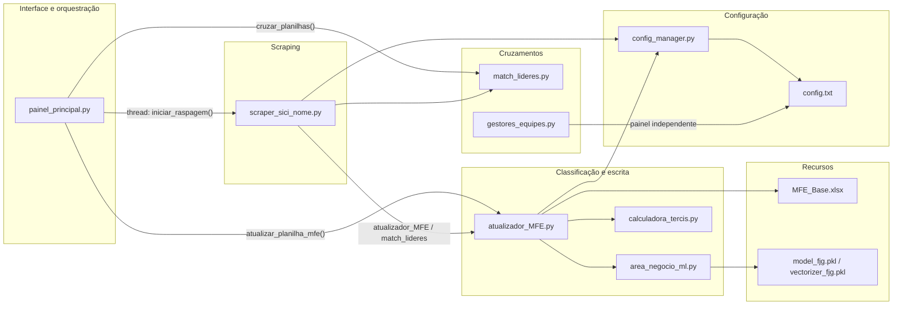

# Documentação técnica

Auditoria técnica e rastreabilidade de dados do **webscraper SICI** da Prefeitura do Rio. Esta documentação descreve o fluxo dos dados, a arquitetura e uma avaliação técnica da implementação.

## Visão geral

O sistema automatiza a extração da árvore de cargos da Prefeitura do Rio (Portal SICI) e a atualização do Mapeamento de Funções Estratégicas (MFE), além de cruzamentos de lideranças (Líderes Cariocas e Liderança Feminina). É uma aplicação de desktop em Python, com interface gráfica (Tkinter), scraping via Selenium/Chrome e processamento de planilhas via pandas/openpyxl.

O ponto de entrada é `painel_principal.py`; o pacote pode ser distribuído como executável `--onedir` via PyInstaller.

## Componentes principais

## O que você encontra aqui

| Página | Pergunta que responde |
|---|---|
| [Fluxo dos dados](data-lineage.md) | Como os dados chegam, são processados e chegam às planilhas? Quais campos são automáticos e quais são manuais? |
| [Arquitetura](architecture.md) | Quais módulos existem, como se relacionam e como o executável é construído? |
| [Avaliação técnica](technical-review.md) | Quais problemas, riscos e melhorias a implementação atual apresenta? |
