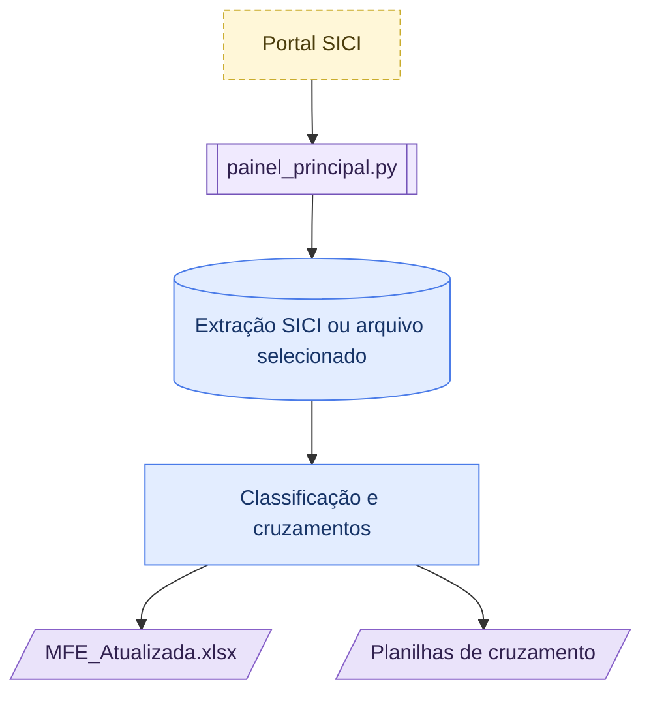

# Documentação técnica

Documentação do **webscraper SICI** da Prefeitura do Rio: uma aplicação desktop em Python que extrai a árvore de cargos do Portal SICI, atualiza o Mapeamento de Funções Estratégicas (MFE) e executa cruzamentos de lideranças.

## Visão geral

O ponto de entrada é `painel_principal.py`. O usuário inicia uma raspagem web ou seleciona uma extração existente; o processamento interno classifica os dados e escreve arquivos locais. O pacote pode ser distribuído como executável `--onedir` via PyInstaller.

### Entradas, processamento e saídas

## O que você encontra aqui

| Página | Pergunta que responde |
|---|---|
| [Fluxo dos dados](data-lineage.md) | Como os dados chegam, são processados e chegam às planilhas? Quais campos são automáticos e quais são manuais? |
| [Arquitetura](architecture.md) | Quais módulos existem, como se relacionam e como o executável é construído? |
| [Avaliação técnica](technical-review.md) | Quais problemas, riscos e melhorias a implementação inicial apresenta? |
| [Manutenção](documentation-maintenance.md) | Como triar, revisar e validar alterações na documentação? |
